# Movie Book

A ReactJS frontend for listing movies and their details using TVmaze API

#### Features:

-   Login using Google
-   Movie details from TVmaze API
-   Displays message of movie booking

### Mobile Screen:

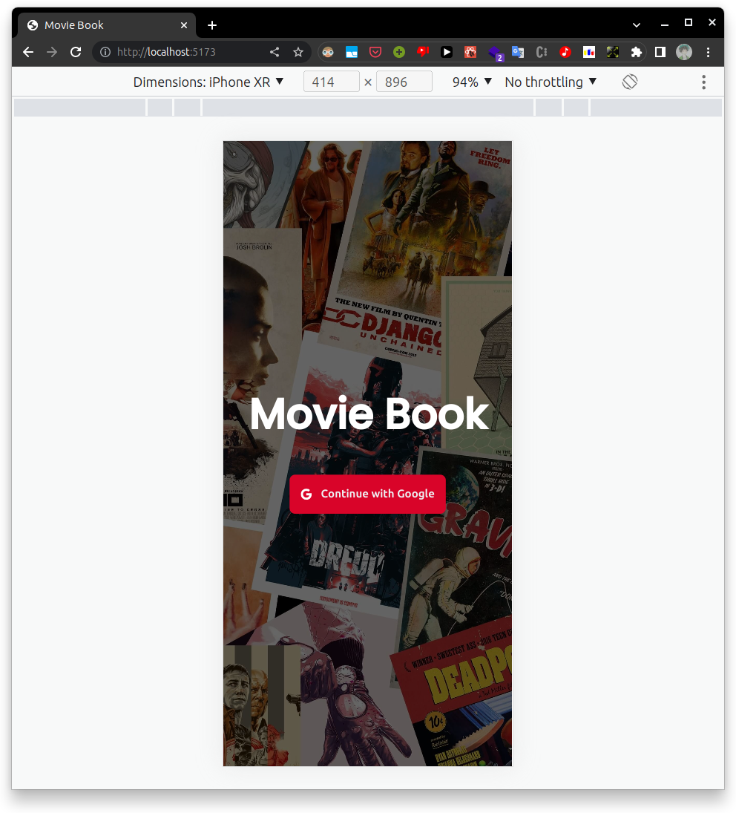
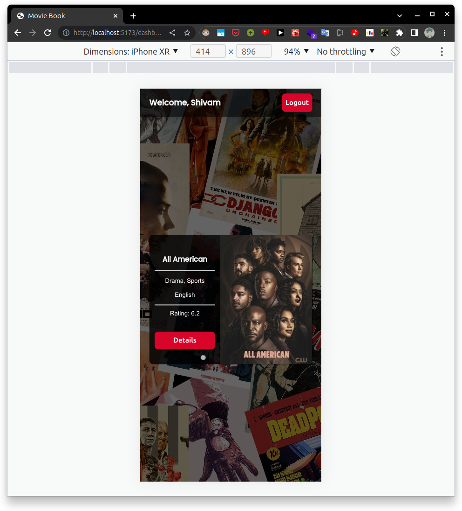
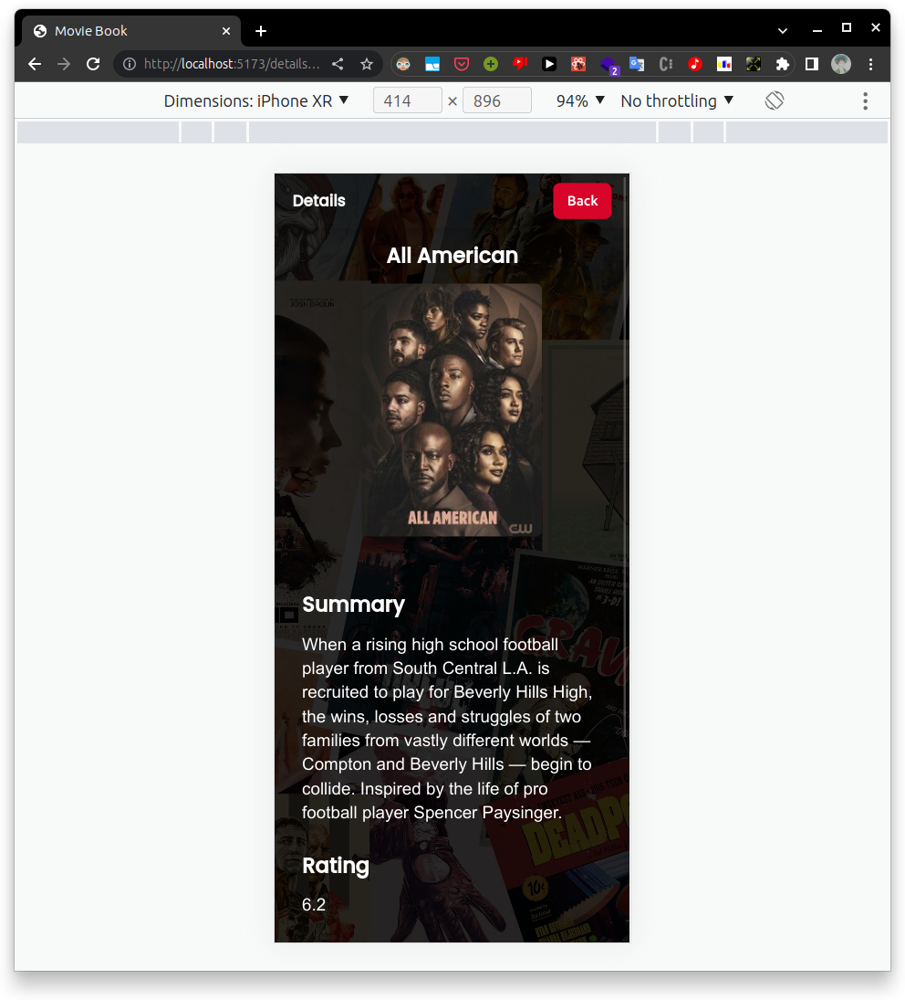
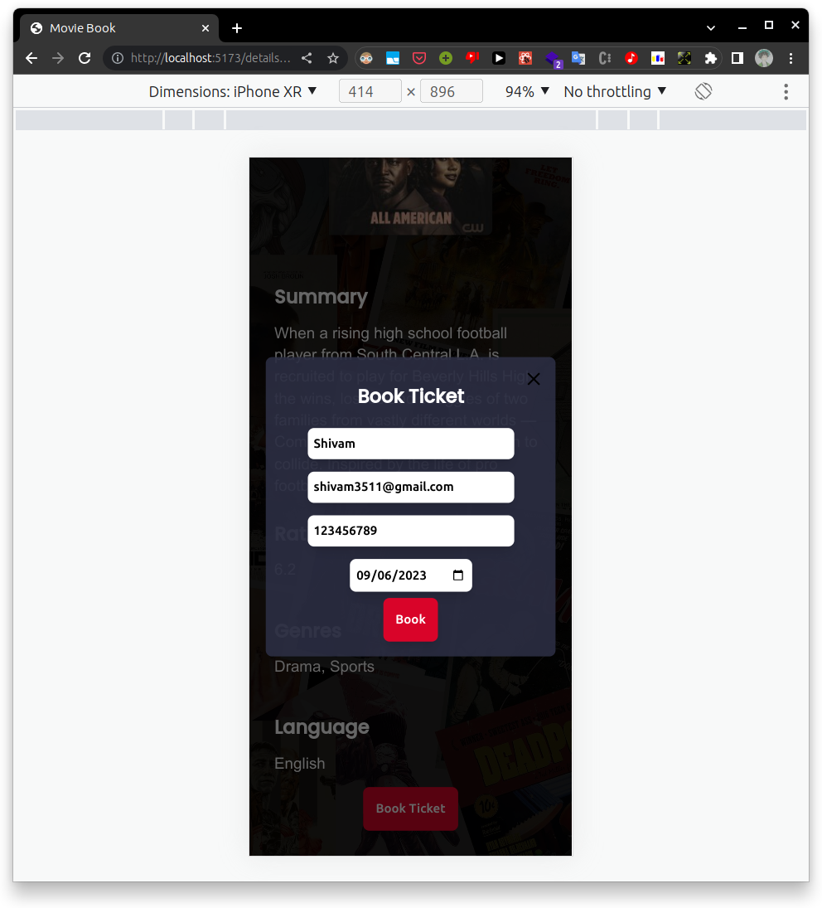
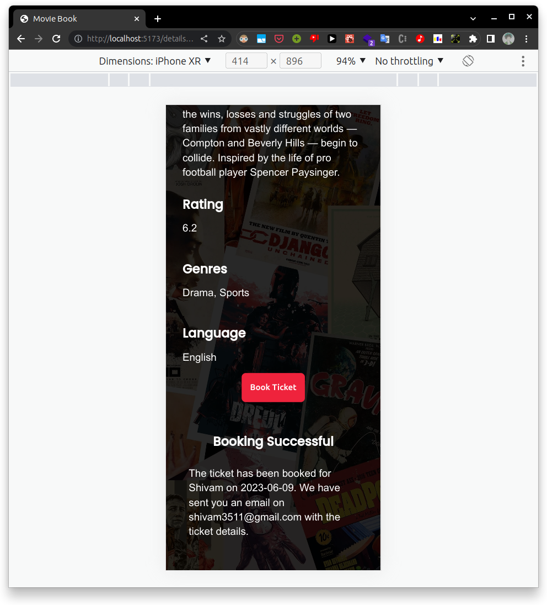

### Tablet Screen:

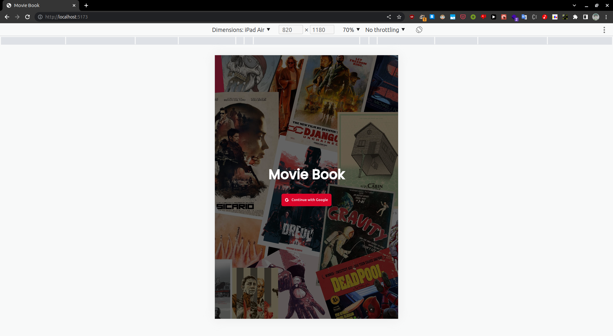

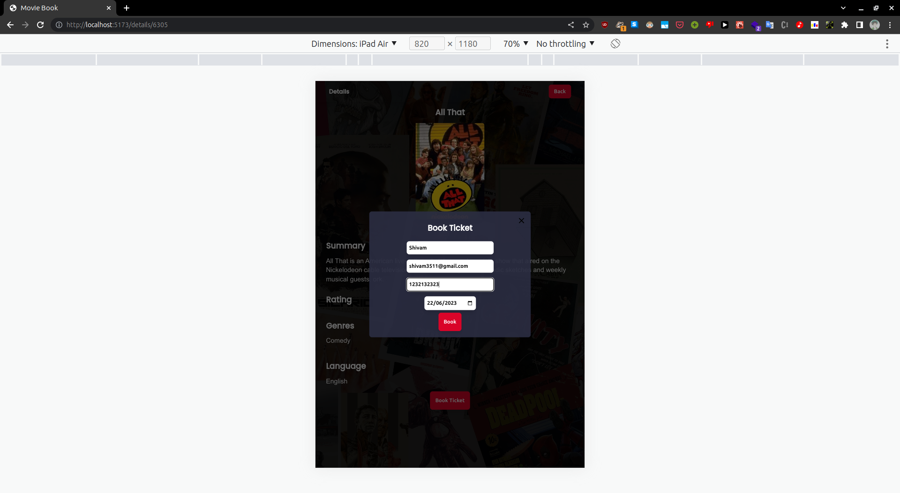
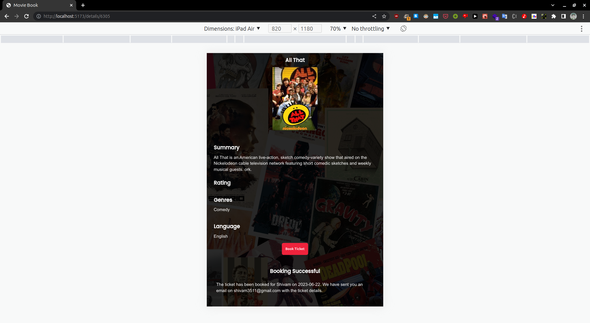

### Laptop Screen:

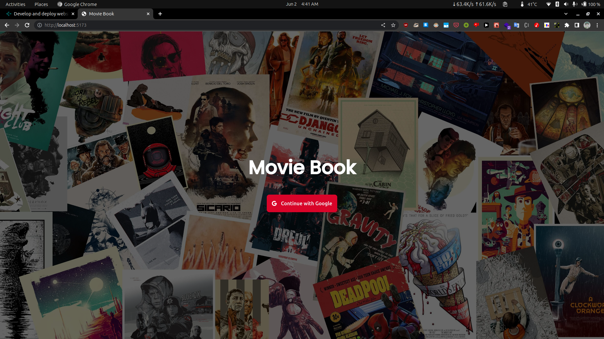
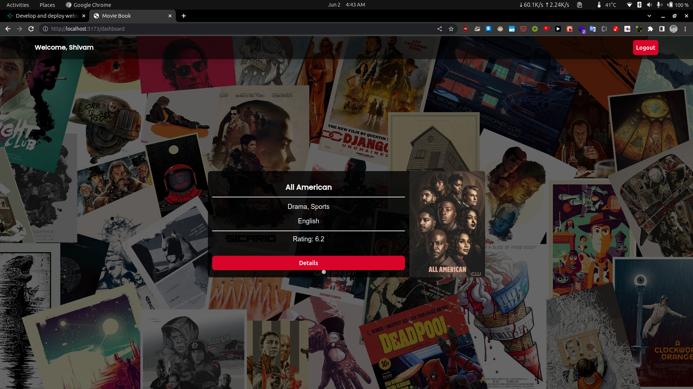
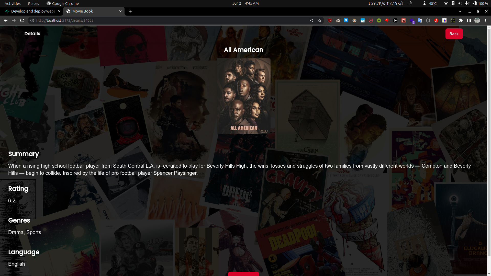
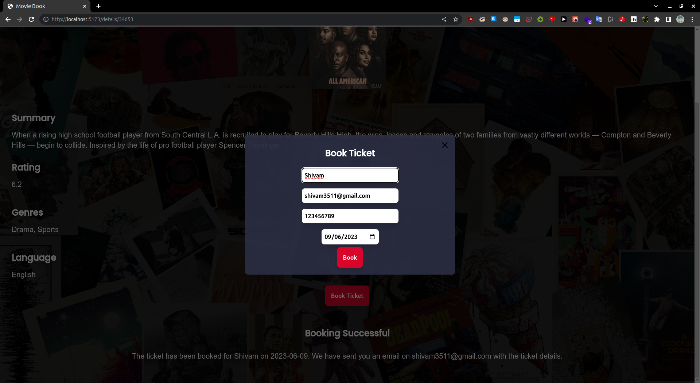
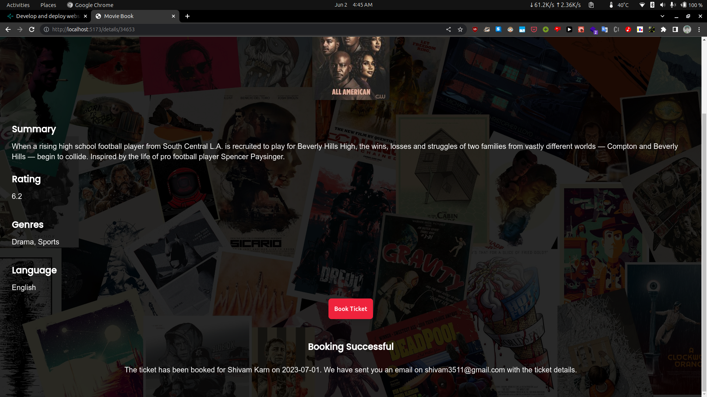
